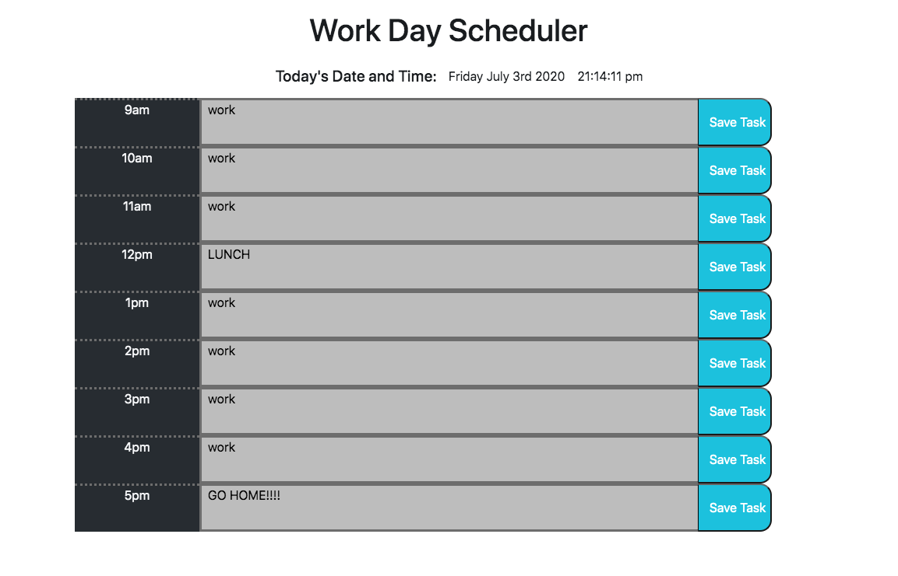

# Work Day Scheduler

## Deployment Link

https://dj-viking.github.io/work-day-scheduler/

## Screenshot

## Summary

- A very simple page that can be a work scheduling helper to keep track of each hourly task
    * Click the empty area inside the timeblock to add a new task or set of tasks.
    * Then click Save Task to store allow the information to persist after closing the browser.
    * The task info will be there when the page is opened from the same computer on the same browser it was opened on.
- Each time block will change color indicating whether the time block is past (grey) present (red) or future (green)

## Current Bugs
- This page definitely works on Google Chrome.
- Tried to run on FireFox and for some reason the clicking inside the box doesn't allow the text field to appear for editing. 